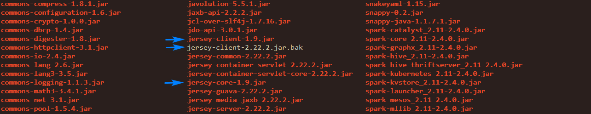

# Ambari在不升级的情况下升级Spark2.x框架

选择的Spark版本为spark-2.4.0-bin-hadoop2.7。

## 内容修改

### 整合Spark的安装包

修改安装包下面的conf下的spark-env.sh的JAVA_HOME和HADOOP_CONF_DIR，如下所示：

```xml
# HADOOP_CONF_DIR
export HADOOP_HOME=${HADOOP_HOME:-/usr/hdp/current/hadoop-client}
export HADOOP_CONF_DIR=${HADOOP_CONF_DIR:-/usr/hdp/current/hadoop-client/conf}
# JAVA_HOME
export JAVA_HOME=/usr/java/jdk1.8.0_111/
```

### 修改安装脚本和配置文件

1）修改Spark的安装脚本

```python
#!/usr/bin/env python
"""
Licensed to the Apache Software Foundation (ASF) under one
or more contributor license agreements.  See the NOTICE file
distributed with this work for additional information
regarding copyright ownership.  The ASF licenses this file
to you under the Apache License, Version 2.0 (the
"License"); you may not use this file except in compliance
with the License.  You may obtain a copy of the License at
    http://www.apache.org/licenses/LICENSE-2.0
Unless required by applicable law or agreed to in writing, software
distributed under the License is distributed on an "AS IS" BASIS,
WITHOUT WARRANTIES OR CONDITIONS OF ANY KIND, either express or implied.
See the License for the specific language governing permissions and
limitations under the License.
"""
from resource_management import *
from resource_management.core.logger import Logger
from resource_management.core.resources.system import Execute
# import commons module
from resource_management.libraries.functions.commons import get_hdp_baseurl
import subprocess
import os
# TODO: spark2 install
# update by hzhiping@linewell.com on 2018.08.06
def custom_install():
    # update by hzhiping@linewell.com on 2019.01.20
    package_version = '2.4.0-bin-hadoop2.7'
    hdp_version = '2.5.3.0-37'
    # def string
    download_url = '{0}spark-{1}.tgz'.format(get_hdp_baseurl(), package_version)
    install_dir = "/usr/hdp/{0}/".format(hdp_version)
    # make direction
    Execute('mkdir -p /usr/hdp/current/')
    Execute('mkdir -p {0}'.format(install_dir))
    # check install
    if os.access('/usr/hdp/2.5.3.0-37/spark-{0}'.format(package_version), os.F_OK):
        Logger.info("spark Service has been installed")
        return
    # download
    Execute('wget {0} -O spark2.tar.gz'.format(download_url))
    # install
    Logger.info("tar spark2 and then delete it...")
    Execute('tar -zxvf spark2.tar.gz -C {0} && rm -f spark2.tar.gz'.format(install_dir))
    # ln -s stacks
    if not os.access('/usr/hdp', os.F_OK):
        Execute('ln -s /usr/hdp /usr/hdp')
    # ln -s package
    Execute('rm -rf /usr/hdp/{0}/spark2'.format(hdp_version))
    # ln -s /usr/hdp/2.5.3.0-37/spark-2.0.0-LW-bin-hadoop-2.7.3 /usr/hdp/2.5.3.0-37/spark2
    Execute('ln -s /usr/hdp/{0}/spark-{1} /usr/hdp/{0}/spark2'.format(hdp_version, package_version))
    # ln -s lib
    Execute('rm -rf /usr/lib/spark2')
    Execute('ln -s /usr/hdp/{0}/spark-{1} /usr/lib/spark2'.format(hdp_version, package_version))
    # ln -s cfg
    Execute('rm -rf /etc/spark2/conf')
    Execute('rm -rf /etc/spark2/{0}'.format(hdp_version))
    Execute('mkdir -p /etc/spark2/{0}/0'.format(hdp_version))
    Execute('cp /usr/hdp/{0}/spark-{1}/conf/* /etc/spark2/{0}/0'.format(hdp_version, package_version))
    Execute('rm -rf /usr/hdp/{0}/spark-{1}/conf/'.format(hdp_version, package_version))
    Execute('ln -s /etc/spark2/{0}/0 /etc/spark2/conf'.format(hdp_version))
    Execute('ln -s /etc/spark2/{0}/0 /usr/hdp/{0}/spark-{1}/conf'.format(hdp_version, package_version))
    # ln -s /usr/bin
    # pyspark spark-class  sparkR  spark-shell  spark-sql  spark-submit load-spark-env.sh
    Execute('rm -rf /usr/bin/pyspark')
    Execute('rm -rf /usr/bin/spark-class')
    Execute('rm -rf /usr/bin/sparkR')
    Execute('rm -rf /usr/bin/spark-shell')
    Execute('rm -rf /usr/bin/spark-sql')
    Execute('rm -rf /usr/bin/spark-submit')
    Execute('rm -rf /usr/bin/load-spark-env.sh')
    Execute('ln -s /usr/hdp/{0}/spark-{1}/bin/pyspark /usr/bin/pyspark'.format(hdp_version, package_version))
    Execute('ln -s /usr/hdp/{0}/spark-{1}/bin/spark-class /usr/bin/spark-class'.format(hdp_version, package_version))
    Execute('ln -s /usr/hdp/{0}/spark-{1}/bin/sparkR /usr/bin/sparkR'.format(hdp_version, package_version))
    Execute('ln -s /usr/hdp/{0}/spark-{1}/bin/spark-shell /usr/bin/spark-shell'.format(hdp_version, package_version))
    Execute('ln -s /usr/hdp/{0}/spark-{1}/bin/spark-sql /usr/bin/spark-sql'.format(hdp_version, package_version))
    Execute('ln -s /usr/hdp/{0}/spark-{1}/bin/spark-submit /usr/bin/spark-submit'.format(hdp_version, package_version))
    Execute('ln -s /usr/hdp/{0}/spark-{1}/bin/load-spark-env.sh /usr/bin/load-spark-env.sh'.format(hdp_version,package_version))
    # log succ
    Logger.info("Spark2 installed successfully!")
```

2）修改Spark的配置，屏蔽Spark的rpm安装和Hive依赖，具体位置为/var/lib/ambari-server/resources/common-services/SPARK2/2.0.0/metainfo.xml：

```xml
<?xml version="1.0"?>
<!--Licensed to the Apache Software Foundation (ASF) under one
* or more contributor license agreements.  See the NOTICE file
* distributed with this work for additional information
* regarding copyright ownership.  The ASF licenses this file
* to you under the Apache License, Version 2.0 (the
* "License"); you may not use this file except in compliance
* with the License.  You may obtain a copy of the License at
*
*     http://www.apache.org/licenses/LICENSE-2.0
*
* Unless required by applicable law or agreed to in writing, software
* distributed under the License is distributed on an "AS IS" BASIS,
* WITHOUT WARRANTIES OR CONDITIONS OF ANY KIND, either express or implied.
* See the License for the specific language governing permissions and
* limitations under the License.
*/
-->
<metainfo>
    <schemaVersion>2.0</schemaVersion>
    <services>
        <service>
            <name>SPARK2</name>
            <displayName>Spark2</displayName>
            <comment>Apache Spark 2.0 is a fast and general engine for large-scala data processing.
            </comment>
            <version>2.0.0</version>
            <components>
                <component>
                    <name>SPARK2_JOBHISTORYSERVER</name>
                    <displayName>Spark2 History Server</displayName>
                    <category>MASTER</category>
                    <cardinality>1</cardinality>
                    <versionAdvertised>true</versionAdvertised>
                    <dependencies>
                        <dependency>
                            <name>HDFS/HDFS_CLIENT</name>
                            <scope>host</scope>
                            <auto-deploy>
                                <enabled>true</enabled>
                            </auto-deploy>
                        </dependency>
                        <dependency>
                            <name>MAPREDUCE2/MAPREDUCE2_CLIENT</name>
                            <scope>host</scope>
                            <auto-deploy>
                                <enabled>true</enabled>
                            </auto-deploy>
                        </dependency>
                        <dependency>
                            <name>YARN/YARN_CLIENT</name>
                            <scope>host</scope>
                            <auto-deploy>
                                <enabled>true</enabled>
                            </auto-deploy>
                        </dependency>
                    </dependencies>
                    <commandScript>
                        <script>scripts/job_history_server.py</script>
                        <scriptType>PYTHON</scriptType>
                        <timeout>600</timeout>
                    </commandScript>
                    <logs>
                        <log>
                            <logId>spark2_jobhistory_server</logId>
                            <primary>true</primary>
                        </log>
                    </logs>
                </component>
                <component>
                    <name>SPARK2_THRIFTSERVER</name>
                    <displayName>Spark2 Thrift Server</displayName>
                    <category>SLAVE</category>
                    <cardinality>0+</cardinality>
                    <versionAdvertised>true</versionAdvertised>
                    <dependencies>
                        <dependency>
                            <name>HDFS/HDFS_CLIENT</name>
                            <scope>host</scope>
                            <auto-deploy>
                                <enabled>true</enabled>
                            </auto-deploy>
                        </dependency>
                        <dependency>
                            <name>MAPREDUCE2/MAPREDUCE2_CLIENT</name>
                            <scope>host</scope>
                            <auto-deploy>
                                <enabled>true</enabled>
                            </auto-deploy>
                        </dependency>
                        <dependency>
                            <name>YARN/YARN_CLIENT</name>
                            <scope>host</scope>
                            <auto-deploy>
                                <enabled>true</enabled>
                            </auto-deploy>
                        </dependency>
                        <dependency>
                            <name>HIVE/HIVE_METASTORE</name>
                            <scope>cluster</scope>
                            <auto-deploy>
                                <enabled>true</enabled>
                            </auto-deploy>
                        </dependency>
                    </dependencies>
                    <commandScript>
                        <script>scripts/spark_thrift_server.py</script>
                        <scriptType>PYTHON</scriptType>
                        <timeout>600</timeout>
                    </commandScript>
                    <logs>
                        <log>
                            <logId>spark2_thriftserver</logId>
                            <primary>true</primary>
                        </log>
                    </logs>
                </component>
                <component>
                    <name>SPARK2_CLIENT</name>
                    <displayName>Spark2 Client</displayName>
                    <category>CLIENT</category>
                    <cardinality>1+</cardinality>
                    <versionAdvertised>true</versionAdvertised>
                    <dependencies>
                        <dependency>
                            <name>HDFS/HDFS_CLIENT</name>
                            <scope>host</scope>
                            <auto-deploy>
                                <enabled>true</enabled>
                            </auto-deploy>
                        </dependency>
                        <dependency>
                            <name>MAPREDUCE2/MAPREDUCE2_CLIENT</name>
                            <scope>host</scope>
                            <auto-deploy>
                                <enabled>true</enabled>
                            </auto-deploy>
                        </dependency>
                        <dependency>
                            <name>YARN/YARN_CLIENT</name>
                            <scope>host</scope>
                            <auto-deploy>
                                <enabled>true</enabled>
                            </auto-deploy>
                        </dependency>
                    </dependencies>
                    <commandScript>
                        <script>scripts/spark_client.py</script>
                        <scriptType>PYTHON</scriptType>
                        <timeout>600</timeout>
                    </commandScript>
                    <configFiles>
                        <configFile>
                            <type>env</type>
                            <fileName>spark-log4j.properties</fileName>
                            <dictionaryName>spark2-log4j-properties</dictionaryName>
                        </configFile>
                        <configFile>
                            <type>env</type>
                            <fileName>spark-env.sh</fileName>
                            <dictionaryName>spark2-env</dictionaryName>
                        </configFile>
                        <configFile>
                            <type>env</type>
                            <fileName>spark-metrics.properties</fileName>
                            <dictionaryName>spark2-metrics-properties</dictionaryName>
                        </configFile>
                        <configFile>
                            <type>properties</type>
                            <fileName>spark-defaults.conf</fileName>
                            <dictionaryName>spark2-defaults</dictionaryName>
                        </configFile>
                    </configFiles>
                </component>
            </components>
            <configuration-dependencies>
                <config-type>spark2-defaults</config-type>
                <config-type>spark2-env</config-type>
                <config-type>spark2-log4j-properties</config-type>
                <config-type>spark2-metrics-properties</config-type>
                <config-type>spark2-thrift-sparkconf</config-type>
                <config-type>spark2-hive-site-override</config-type>
                <config-type>spark2-thrift-fairscheduler</config-type>
            </configuration-dependencies>
            <commandScript>
                <script>scripts/service_check.py</script>
                <scriptType>PYTHON</scriptType>
                <timeout>300</timeout>
            </commandScript>
            <requiredServices>
                <service>HDFS</service>
                <service>YARN</service>
                <!--
                <service>HIVE</service>
                -->
            </requiredServices>
            <!--
              <osSpecifics>
                    <osSpecific>
                      <osFamily>redhat7,amazon2015,redhat6,suse11,suse12</osFamily>
                      <packages>
                        <package>
                          <name>spark2_${stack_version}</name>
                        </package>
                        <package>
                          <name>spark2_${stack_version}-python</name>
                        </package>
                      </packages>
                    </osSpecific>
                    <osSpecific>
                      <osFamily>debian7,ubuntu12,ubuntu14,ubuntu16</osFamily>
                      <packages>
                        <package>
                          <name>spark2-${stack_version}</name>
                        </package>
                        <package>
                          <name>spark2-${stack_version}-python</name>
                        </package>
                      </packages>
                    </osSpecific>
                  </osSpecifics>
            -->
            <quickLinksConfigurations>
                <quickLinksConfiguration>
                    <fileName>quicklinks.json</fileName>
                    <default>true</default>
                </quickLinksConfiguration>
            </quickLinksConfigurations>
        </service>
    </services>
</metainfo>
```

3）修改Spark的版本号，具体位置在/var/lib/ambari-server/resources/stacks/HDP/2.5/services/SPARK2/metainfo.xml：

```xml
<?xml version="1.0"?>
<!--
/**
 * Licensed to the Apache Software Foundation (ASF) under one
 * or more contributor license agreements.  See the NOTICE file
 * distributed with this work for additional information
 * regarding copyright ownership.  The ASF licenses this file
 * to you under the Apache License, Version 2.0 (the
 * "License"); you may not use this file except in compliance
 * with the License.  You may obtain a copy of the License at
 *
 *     http://www.apache.org/licenses/LICENSE-2.0
 *
 * Unless required by applicable law or agreed to in writing, software
 * distributed under the License is distributed on an "AS IS" BASIS,
 * WITHOUT WARRANTIES OR CONDITIONS OF ANY KIND, either express or implied.
 * See the License for the specific language governing permissions and
 * limitations under the License.
 */
-->
<metainfo>
  <schemaVersion>2.0</schemaVersion>
  <services>
    <service>
      <name>SPARK2</name>
      <version>2.4.0</version>
      <extends>common-services/SPARK2/2.0.0</extends>
    </service>
  </services>
</metainfo>
```

## 拷贝到Ambari的相关目录下

1）将Spark的安装包拷贝到仓库目录下，此处是拷贝到/var/www/html/ambari/HDP/centos7目录下；

2）将编译后的所有*.py拷贝到目录/var/lib/ambari-server/resources/common-services/SPARK2/2.0.0/package/scripts/下；

3）将屏蔽rpm安装的metainfo.xml拷贝到目录/var/lib/ambari-server/resources/common-services/SPARK2/2.0.0下；

4）将修改SPARK版本号的metainfo.xml拷贝到/var/lib/ambari-server/resources/stacks/HDP/2.5/services/SPARK2目录下；

注意：关于2）、3）、4）部分，还需要拷贝到ambari-agent节点的对应目录下，对应的目录为：

/var/lib/ambari-agent/cache/common-services/SPARK2/2.0.0/package/scripts/

/var/lib/ambari-agent/cache/common-services/SPARK2/2.0.0/0.8.1/

/var/lib/ambari-agent/cache/stacks/HDP/2.5/services/SPARK2/

另外，如果已经安装过SPARK2，删除重新安装的话，此时SPARK2的版本号已经被写到数据库中了，因此需要修改数据库的数据。具体此处不再赘述！

## 拷贝配置文件

分别将Hadoop的core-site.xml和hdfs-site.xml两个配置文件拷贝到Spark2的conf下面。如果需要整合Spark2和已有的Hive或者将Hive作为外部数据源使用spark-sql，还需要将hive-site.xml文件拷贝到conf目录。

## 解决版本包冲突

需要解决jersey包版本冲突问题，集群hadoop-yarn的jersey的依赖包版本低于Spark2的对应的版本包，所以这里需要对Spark2的相关依赖包进行降级，替换成Hadoop对应版本的。

具体做法，是将/usr/hdp/current/hadoop-yarn/lib/目录下的jersey-core-1.9.jar，jersey-client-1.9.jar这两个包拷贝到Spark2的jars目录下，同时，将Spark2对应的高版本包去掉，具体如图所示：



## 遇到的问题

### 问题一

如果Spark2安装了Spark Thrift Server，出现启动起来之后就报错的情况，查看日志/var/log/spark2/spark-hive-org.apache.spark.sql.hive.thriftserver.HiveThriftServer2-1-hadoop1.out报错如下：

```properties
Exception in thread "main" org.apache.spark.SparkException: Application application_1548991617640_0005 failed 2 times due to AM Container for appattempt_1548991617640_0005_000002 exited with  exitCode: 1
For more detailed output, check the application tracking page: http://hadoop3.lw:8088/cluster/app/application_1548991617640_0005 Then click on links to logs of each attempt.
Diagnostics: Exception from container-launch.
Container id: container_e10_1548991617640_0005_02_000001
Exit code: 1
Exception message: /data3/hadoop/yarn/local/usercache/hive/appcache/application_1548991617640_0005/container_e10_1548991617640_0005_02_000001/launch_container.sh:行21: $PWD:$PWD/__spark_conf__:$PWD/__spark_libs__/*:$HADOOP_CONF_DIR:/usr/hdp/current/hadoop-client/*:/usr/hdp/current/hadoop-client/lib/*:/usr/hdp/current/hadoop-hdfs-client/*:/usr/hdp/current/hadoop-hdfs-client/lib/*:/usr/hdp/current/hadoop-yarn-client/*:/usr/hdp/current/hadoop-yarn-client/lib/*:$PWD/mr-framework/hadoop/share/hadoop/mapreduce/*:$PWD/mr-framework/hadoop/share/hadoop/mapreduce/lib/*:$PWD/mr-framework/hadoop/share/hadoop/common/*:$PWD/mr-framework/hadoop/share/hadoop/common/lib/*:$PWD/mr-framework/hadoop/share/hadoop/yarn/*:$PWD/mr-framework/hadoop/share/hadoop/yarn/lib/*:$PWD/mr-framework/hadoop/share/hadoop/hdfs/*:$PWD/mr-framework/hadoop/share/hadoop/hdfs/lib/*:$PWD/mr-framework/hadoop/share/hadoop/tools/lib/*:/usr/hdp/${hdp.version}/hadoop/lib/hadoop-lzo-0.6.0.${hdp.version}.jar:/etc/hadoop/conf/secure:$PWD/__spark_conf__/__hadoop_conf__: 坏的替换
Stack trace: ExitCodeException exitCode=1: /data3/hadoop/yarn/local/usercache/hive/appcache/application_1548991617640_0005/container_e10_1548991617640_0005_02_000001/launch_container.sh:行21: $PWD:$PWD/__spark_conf__:$PWD/__spark_libs__/*:$HADOOP_CONF_DIR:/usr/hdp/current/hadoop-client/*:/usr/hdp/current/hadoop-client/lib/*:/usr/hdp/current/hadoop-hdfs-client/*:/usr/hdp/current/hadoop-hdfs-client/lib/*:/usr/hdp/current/hadoop-yarn-client/*:/usr/hdp/current/hadoop-yarn-client/lib/*:$PWD/mr-framework/hadoop/share/hadoop/mapreduce/*:$PWD/mr-framework/hadoop/share/hadoop/mapreduce/lib/*:$PWD/mr-framework/hadoop/share/hadoop/common/*:$PWD/mr-framework/hadoop/share/hadoop/common/lib/*:$PWD/mr-framework/hadoop/share/hadoop/yarn/*:$PWD/mr-framework/hadoop/share/hadoop/yarn/lib/*:$PWD/mr-framework/hadoop/share/hadoop/hdfs/*:$PWD/mr-framework/hadoop/share/hadoop/hdfs/lib/*:$PWD/mr-framework/hadoop/share/hadoop/tools/lib/*:/usr/hdp/${hdp.version}/hadoop/lib/hadoop-lzo-0.6.0.${hdp.version}.jar:/etc/hadoop/conf/secure:$PWD/__spark_conf__/__hadoop_conf__: 坏的替换
    at org.apache.hadoop.util.Shell.runCommand(Shell.java:933)
    at org.apache.hadoop.util.Shell.run(Shell.java:844)
    at org.apache.hadoop.util.Shell$ShellCommandExecutor.execute(Shell.java:1123)
    at org.apache.hadoop.yarn.server.nodemanager.DefaultContainerExecutor.launchContainer(DefaultContainerExecutor.java:225)
    at org.apache.hadoop.yarn.server.nodemanager.containermanager.launcher.ContainerLaunch.call(ContainerLaunch.java:317)
    at org.apache.hadoop.yarn.server.nodemanager.containermanager.launcher.ContainerLaunch.call(ContainerLaunch.java:83)
    at java.util.concurrent.FutureTask.run(FutureTask.java:266)
    at java.util.concurrent.ThreadPoolExecutor.runWorker(ThreadPoolExecutor.java:1142)
    at java.util.concurrent.ThreadPoolExecutor$Worker.run(ThreadPoolExecutor.java:617)
    at java.lang.Thread.run(Thread.java:745)
Container exited with a non-zero exit code 1
Failing this attempt. Failing the application.
    at org.apache.spark.scheduler.cluster.YarnClientSchedulerBackend.waitForApplication(YarnClientSchedulerBackend.scala:94)
    at org.apache.spark.scheduler.cluster.YarnClientSchedulerBackend.start(YarnClientSchedulerBackend.scala:63)
    at org.apache.spark.scheduler.TaskSchedulerImpl.start(TaskSchedulerImpl.scala:178)
    at org.apache.spark.SparkContext.<init>(SparkContext.scala:501)
    at org.apache.spark.SparkContext$.getOrCreate(SparkContext.scala:2520)
    at org.apache.spark.sql.SparkSession$Builder$$anonfun$7.apply(SparkSession.scala:935)
    at org.apache.spark.sql.SparkSession$Builder$$anonfun$7.apply(SparkSession.scala:926)
    at scala.Option.getOrElse(Option.scala:121)
    at org.apache.spark.sql.SparkSession$Builder.getOrCreate(SparkSession.scala:926)
    at org.apache.spark.sql.hive.thriftserver.SparkSQLEnv$.init(SparkSQLEnv.scala:48)
    at org.apache.spark.sql.hive.thriftserver.HiveThriftServer2$.main(HiveThriftServer2.scala:79)
    at org.apache.spark.sql.hive.thriftserver.HiveThriftServer2.main(HiveThriftServer2.scala)
    at sun.reflect.NativeMethodAccessorImpl.invoke0(Native Method)
    at sun.reflect.NativeMethodAccessorImpl.invoke(NativeMethodAccessorImpl.java:62)
    at sun.reflect.DelegatingMethodAccessorImpl.invoke(DelegatingMethodAccessorImpl.java:43)
    at java.lang.reflect.Method.invoke(Method.java:498)
    at org.apache.spark.deploy.JavaMainApplication.start(SparkApplication.scala:52)
    at org.apache.spark.deploy.SparkSubmit.org$apache$spark$deploy$SparkSubmit$$runMain(SparkSubmit.scala:849)
    at org.apache.spark.deploy.SparkSubmit.doRunMain$1(SparkSubmit.scala:167)
    at org.apache.spark.deploy.SparkSubmit.submit(SparkSubmit.scala:195)
    at org.apache.spark.deploy.SparkSubmit.doSubmit(SparkSubmit.scala:86)
    at org.apache.spark.deploy.SparkSubmit$$anon$2.doSubmit(SparkSubmit.scala:924)
    at org.apache.spark.deploy.SparkSubmit$.main(SparkSubmit.scala:933)
    at org.apache.spark.deploy.SparkSubmit.main(SparkSubmit.scala)
19/02/01 11:53:35 INFO ShutdownHookManager: Shutdown hook called
19/02/01 11:53:35 INFO ShutdownHookManager: Deleting directory /tmp/spark-017895e1-bdd2-4e9e-92fe-18b3681d88e5
19/02/01 11:53:35 INFO ShutdownHookManager: Deleting directory /tmp/spark-71c7d495-c14d-44e3-a81e-2b664e71e0b9
```

解决办法：将MapReduce组件中的mapreduce.application.classpath选项中的${hdp-version}修改为具体的版本号即可，原来的内容如下：

```xml
$PWD/mr-framework/hadoop/share/hadoop/mapreduce/*:$PWD/mr-framework/hadoop/share/hadoop/mapreduce/lib/*:$PWD/mr-framework/hadoop/share/hadoop/common/*:$PWD/mr-framework/hadoop/share/hadoop/common/lib/*:$PWD/mr-framework/hadoop/share/hadoop/yarn/*:$PWD/mr-framework/hadoop/share/hadoop/yarn/lib/*:$PWD/mr-framework/hadoop/share/hadoop/hdfs/*:$PWD/mr-framework/hadoop/share/hadoop/hdfs/lib/*:$PWD/mr-framework/hadoop/share/hadoop/tools/lib/*:/usr/hdp/${hdp.version}/hadoop/lib/hadoop-lzo-0.6.0.${hdp.version}.jar:/etc/hadoop/conf/secure
```

修改之后如下：

```xml
$PWD/mr-framework/hadoop/share/hadoop/mapreduce/*:$PWD/mr-framework/hadoop/share/hadoop/mapreduce/lib/*:$PWD/mr-framework/hadoop/share/hadoop/common/*:$PWD/mr-framework/hadoop/share/hadoop/common/lib/*:$PWD/mr-framework/hadoop/share/hadoop/yarn/*:$PWD/mr-framework/hadoop/share/hadoop/yarn/lib/*:$PWD/mr-framework/hadoop/share/hadoop/hdfs/*:$PWD/mr-framework/hadoop/share/hadoop/hdfs/lib/*:$PWD/mr-framework/hadoop/share/hadoop/tools/lib/*:/usr/hdp/2.5.3.0-37/hadoop/lib/*:/etc/hadoop/conf/secure
```

### 问题二

Yarn组件的nodemanager启动不起来，查看日志/var/log/hadoop-yarn/yarn/yarn-yarn-nodemanager-hadoop2.log报错内容如下：

```xml
2019-02-01 11:16:36,296 FATAL nodemanager.NodeManager (NodeManager.java:initAndStartNodeManager(549)) - Error starting NodeManager
org.apache.hadoop.service.ServiceStateException: java.lang.ClassNotFoundException: org.apache.spark.network.yarn.YarnShuffleService
    at org.apache.hadoop.service.ServiceStateException.convert(ServiceStateException.java:59)
    at org.apache.hadoop.service.AbstractService.init(AbstractService.java:172)
    at org.apache.hadoop.service.CompositeService.serviceInit(CompositeService.java:107)
    at org.apache.hadoop.yarn.server.nodemanager.containermanager.ContainerManagerImpl.serviceInit(ContainerManagerImpl.java:245)
    at org.apache.hadoop.service.AbstractService.init(AbstractService.java:163)
    at org.apache.hadoop.service.CompositeService.serviceInit(CompositeService.java:107)
    at org.apache.hadoop.yarn.server.nodemanager.NodeManager.serviceInit(NodeManager.java:291)
    at org.apache.hadoop.service.AbstractService.init(AbstractService.java:163)
    at org.apache.hadoop.yarn.server.nodemanager.NodeManager.initAndStartNodeManager(NodeManager.java:546)
    at org.apache.hadoop.yarn.server.nodemanager.NodeManager.main(NodeManager.java:594)
Caused by: java.lang.ClassNotFoundException: org.apache.spark.network.yarn.YarnShuffleService
    at java.net.URLClassLoader.findClass(URLClassLoader.java:381)
    at java.lang.ClassLoader.loadClass(ClassLoader.java:424)
    at sun.misc.Launcher$AppClassLoader.loadClass(Launcher.java:331)
    at java.lang.ClassLoader.loadClass(ClassLoader.java:357)
    at org.apache.hadoop.util.ApplicationClassLoader.loadClass(ApplicationClassLoader.java:197)
    at org.apache.hadoop.util.ApplicationClassLoader.loadClass(ApplicationClassLoader.java:165)
    at java.lang.Class.forName0(Native Method)
    at java.lang.Class.forName(Class.java:348)
    at org.apache.hadoop.yarn.server.nodemanager.containermanager.AuxiliaryServiceWithCustomClassLoader.getInstance(AuxiliaryServiceWithCustomClassLoader.java:169)
    at org.apache.hadoop.yarn.server.nodemanager.containermanager.AuxServices.serviceInit(AuxServices.java:131)
    at org.apache.hadoop.service.AbstractService.init(AbstractService.java:163)
    ... 8 more
2019-02-01 11:16:36,298 INFO  nodemanager.NodeManager (LogAdapter.java:info(45)) - SHUTDOWN_MSG:
/************************************************************
SHUTDOWN_MSG: Shutting down NodeManager at hadoop1/192.168.203.11
************************************************************/
```

找不到类，说明缺少了jar包，经查阅资料发现缺少的是一个spark-yarn-shuffle.jar的包，但是现在仓库已经无法找到该jar包，于是经过替换整合，改成了如下的四个jar包：

```bash
netty-all-4.1.33.Final.jar
spark-network-common_2.11-2.4.0.jar
spark-network-shuffle_2.11-2.4.0.jar
spark-network-yarn_2.11-2.4.0.jar
```

只需要将以上四个jar包拷贝到/usr/hdp/${version}/hadoop/lib目录中即可！

### 问题三

```xml
19/04/10 17:52:59 INFO FairSchedulableBuilder: Created pool: default, schedulingMode: FAIR, minShare: 2, weight: 1
19/04/10 17:52:59 INFO Utils: Using initial executors = 0, max of spark.dynamicAllocation.initialExecutors, spark.dynamicAllocation.minExecutors and spark.executor.instances
Exception in thread "main" java.lang.NoClassDefFoundError: com/sun/jersey/api/client/config/ClientConfig
        at org.apache.hadoop.yarn.client.api.TimelineClient.createTimelineClient(TimelineClient.java:55)
        at org.apache.hadoop.yarn.client.api.impl.YarnClientImpl.createTimelineClient(YarnClientImpl.java:181)
        at org.apache.hadoop.yarn.client.api.impl.YarnClientImpl.serviceInit(YarnClientImpl.java:168)
        at org.apache.hadoop.service.AbstractService.init(AbstractService.java:163)
        at org.apache.spark.deploy.yarn.Client.submitApplication(Client.scala:160)
        at org.apache.spark.scheduler.cluster.YarnClientSchedulerBackend.start(YarnClientSchedulerBackend.scala:57)
        at org.apache.spark.scheduler.TaskSchedulerImpl.start(TaskSchedulerImpl.scala:178)
        at org.apache.spark.SparkContext.<init>(SparkContext.scala:501)
        at org.apache.spark.SparkContext$.getOrCreate(SparkContext.scala:2520)
        at org.apache.spark.sql.SparkSession$Builder$$anonfun$7.apply(SparkSession.scala:935)
        at org.apache.spark.sql.SparkSession$Builder$$anonfun$7.apply(SparkSession.scala:926)
        at scala.Option.getOrElse(Option.scala:121)
        at org.apache.spark.sql.SparkSession$Builder.getOrCreate(SparkSession.scala:926)
        at org.apache.spark.sql.hive.thriftserver.SparkSQLEnv$.init(SparkSQLEnv.scala:48)
        at org.apache.spark.sql.hive.thriftserver.HiveThriftServer2$.main(HiveThriftServer2.scala:79)
        at org.apache.spark.sql.hive.thriftserver.HiveThriftServer2.main(HiveThriftServer2.scala)
        at sun.reflect.NativeMethodAccessorImpl.invoke0(Native Method)
        at sun.reflect.NativeMethodAccessorImpl.invoke(NativeMethodAccessorImpl.java:62)
        at sun.reflect.DelegatingMethodAccessorImpl.invoke(DelegatingMethodAccessorImpl.java:43)
        at java.lang.reflect.Method.invoke(Method.java:498)
        at org.apache.spark.deploy.JavaMainApplication.start(SparkApplication.scala:52)
        at org.apache.spark.deploy.SparkSubmit.org$apache$spark$deploy$SparkSubmit$$runMain(SparkSubmit.scala:849)
        at org.apache.spark.deploy.SparkSubmit.doRunMain$1(SparkSubmit.scala:167)
        at org.apache.spark.deploy.SparkSubmit.submit(SparkSubmit.scala:195)
        at org.apache.spark.deploy.SparkSubmit.doSubmit(SparkSubmit.scala:86)
        at org.apache.spark.deploy.SparkSubmit$$anon$2.doSubmit(SparkSubmit.scala:924)
        at org.apache.spark.deploy.SparkSubmit$.main(SparkSubmit.scala:933)
        at org.apache.spark.deploy.SparkSubmit.main(SparkSubmit.scala)
Caused by: java.lang.ClassNotFoundException: com.sun.jersey.api.client.config.ClientConfig
        at java.net.URLClassLoader.findClass(URLClassLoader.java:381)
        at java.lang.ClassLoader.loadClass(ClassLoader.java:424)
        at sun.misc.Launcher$AppClassLoader.loadClass(Launcher.java:331)
        at java.lang.ClassLoader.loadClass(ClassLoader.java:357)
        ... 28 more
```
