# Ambari注册引导和部署组件

介绍Ambari安装之后的第一次引导，以及组件的部署！其他的组件大同小异，如果比较难，后续学到会继续总结！

## 集群引导

### 启动安装引导

登陆页面之后，启动安装引导：


### 集群命名

接下来给集群命名：

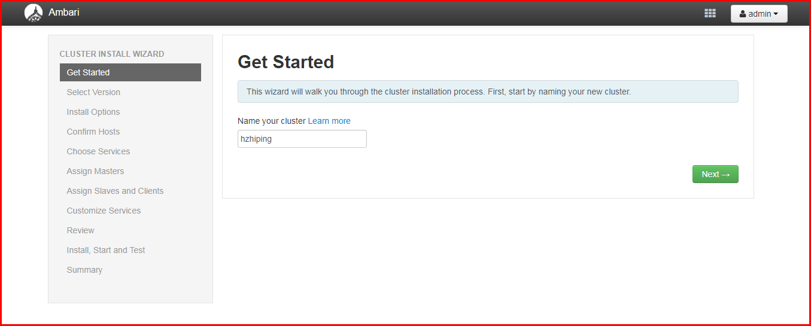

### 版本选择

选择版本库，选择本地的版本库：

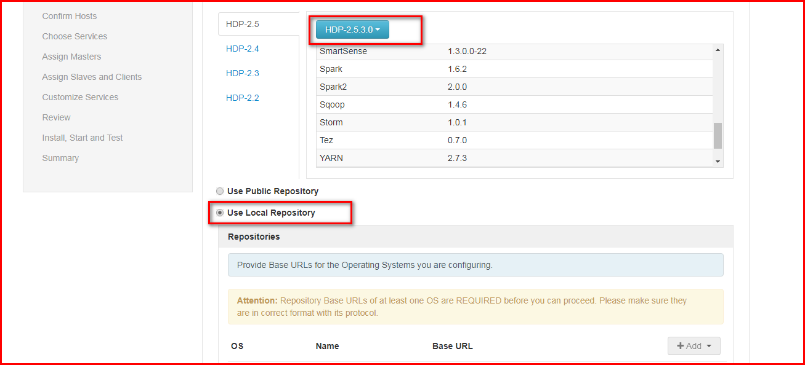

备注：并且移除其他的系统，只留下RedHat7，填入我们的本地资源仓库，也就是我们的repo文件中的baseurl。

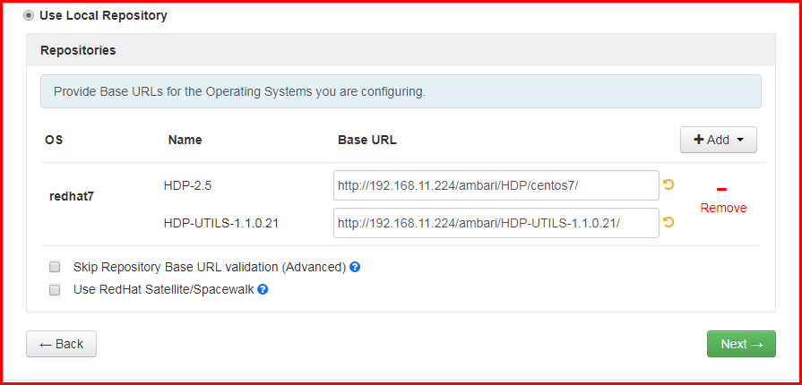

### 注册指定agent

然后根据集群的信息注册agent：

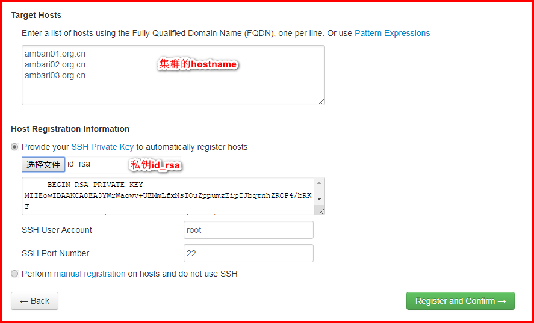

这时候我们发现主机正在注册：

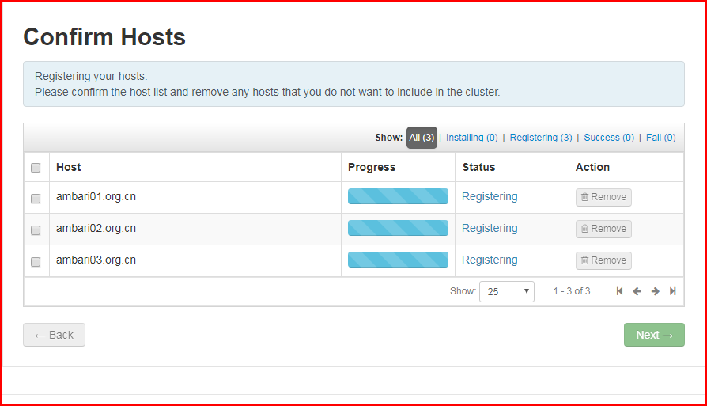

可能会注册失败，但是都能解决，后面会有详解：

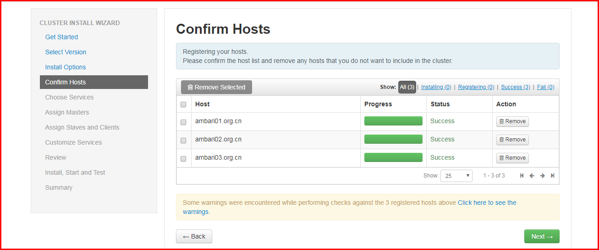

从上图我们发现已经注册成功了，但是还会有警告！

### 解决警告

警告信息：


点击链接，出现警告，根据警告解决：

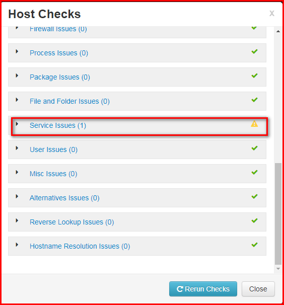

警告解决后：

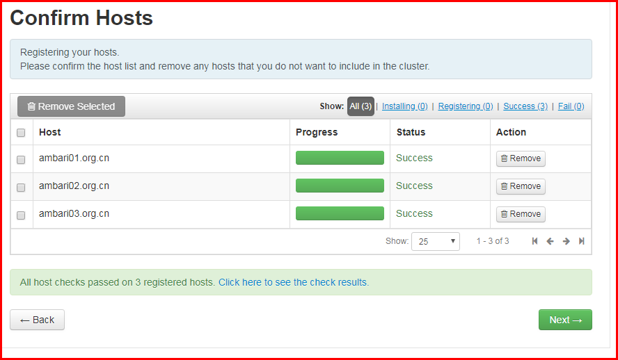

## 组件安装

### 选择服务

选择服务，此处选择Zookeeper和AmbariMetrics:

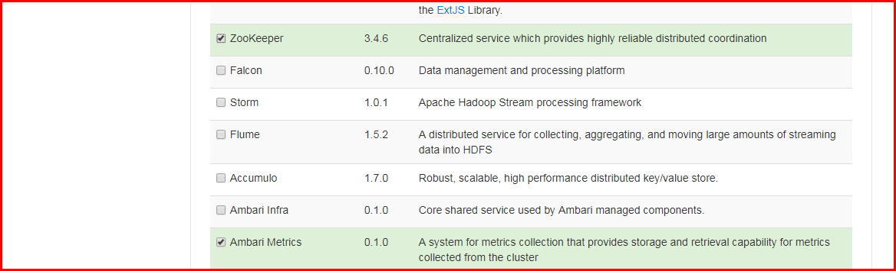

### 服务分配

此处分配服务，看看是要将服务安装在哪一个节点上：

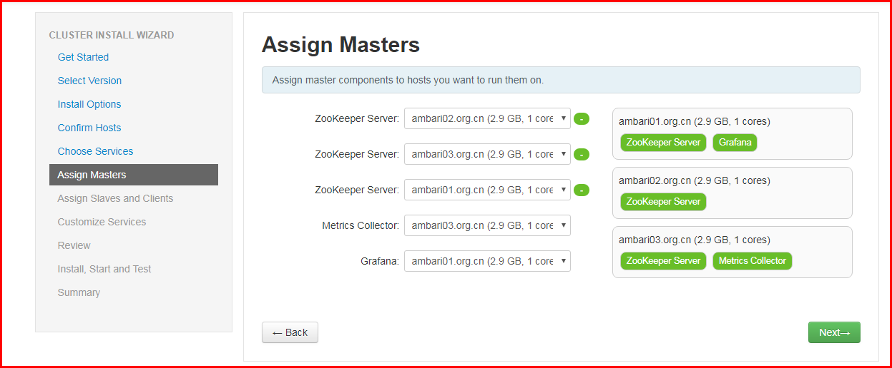

### 分配客户端

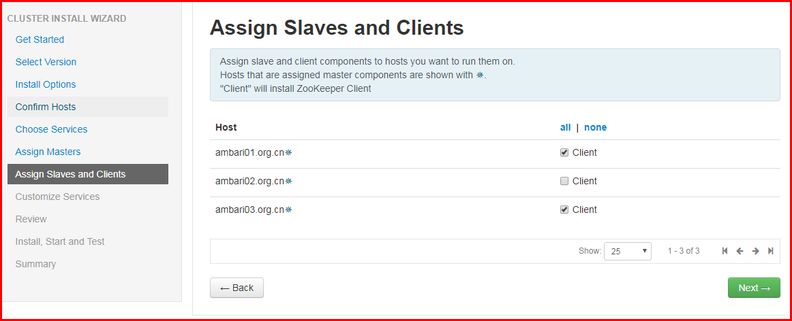

### 配置服务

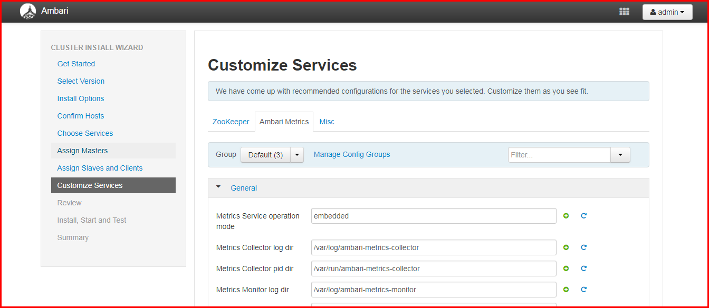

### 检查服务列表

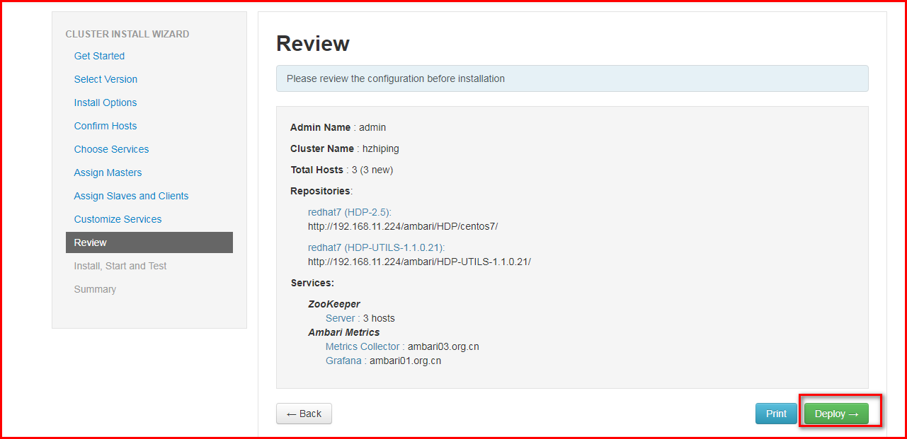

### 安装进度

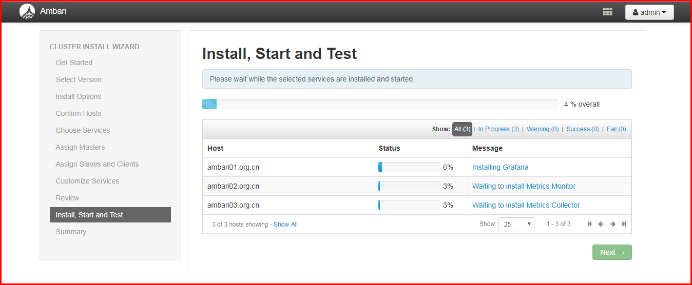

### 安装成功

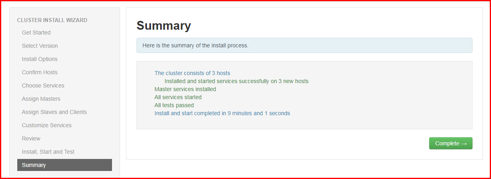

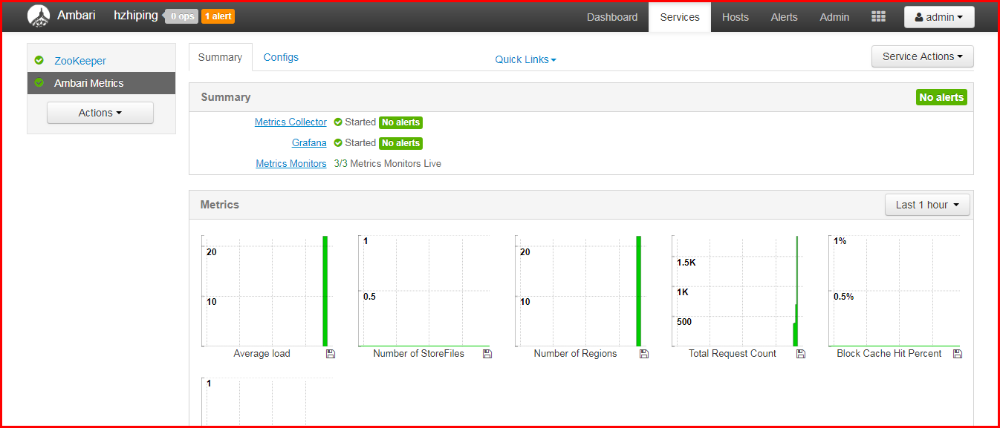

# 问题总结

## 问题一

agent注册错误：

```shell
ERROR 2018-05-30 00:12:25,280 NetUtil.py:96 - EOF occurred in violation of protocol (_ssl.c:579)
ERROR 2018-05-30 00:12:25,280 NetUtil.py:97 - SSLError: Failed to connect. Please check openssl library versions.
```

解决方式一：

```shell
# vim /etc/python/cert-verification.cfg
[https]
verify=disable
```

当然方式一也可以用流式编辑命令sed来修改：

```shell
sed -i 's/verify=platform_default/verify=disable/' /etc/python/cert-verification.cfg
```

解决方式二：

```bash
$ vim /etc/ambari-agent/conf/ambari-agent.ini
```

修改如下内容：

```bash
// add this config to ambari-agent.ini [security]
force_https_protocol=PROTOCOL_TLSv1_2
```

## 问题二

制作本地仓库的问题：

本文章中制作本地仓库中，需要制作ambari.repo、HDP.repo和HDP-UTILS.repo这三个仓库的配置文件，但是实际上，只要能够确保ambari.repo创建没错即可，另外两个文件只要在如下图所示的url中填写没有错误的话，便可以自动在/etc/yum.repos.d/目录下自动生成相关的仓库配置文件！

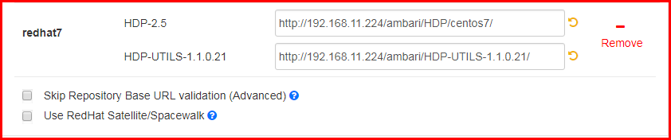
