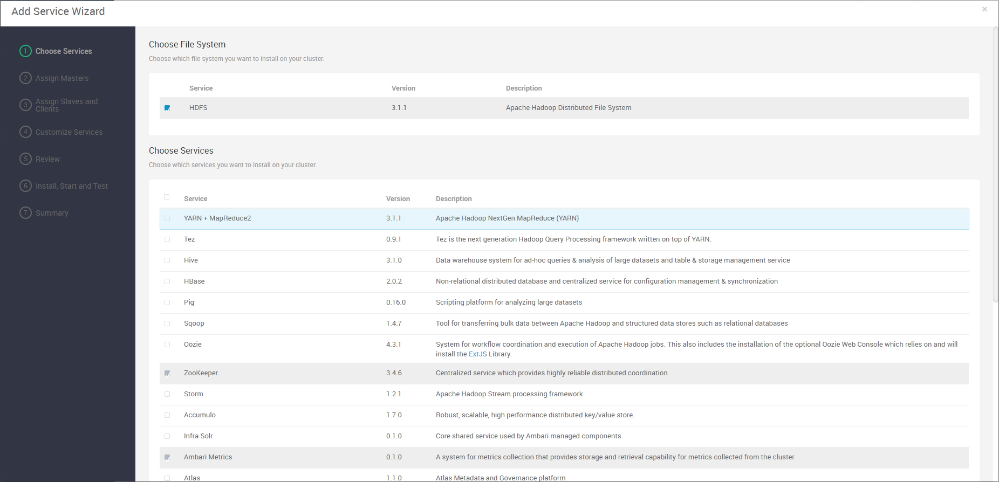
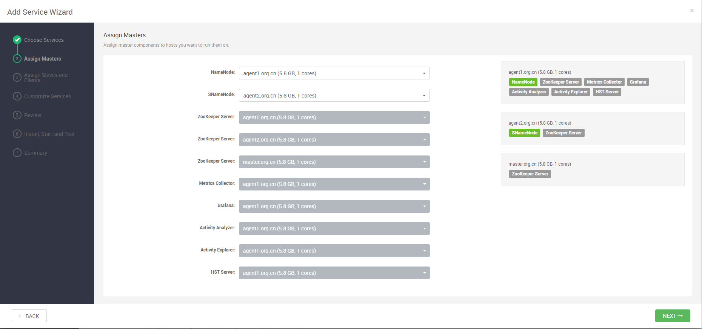
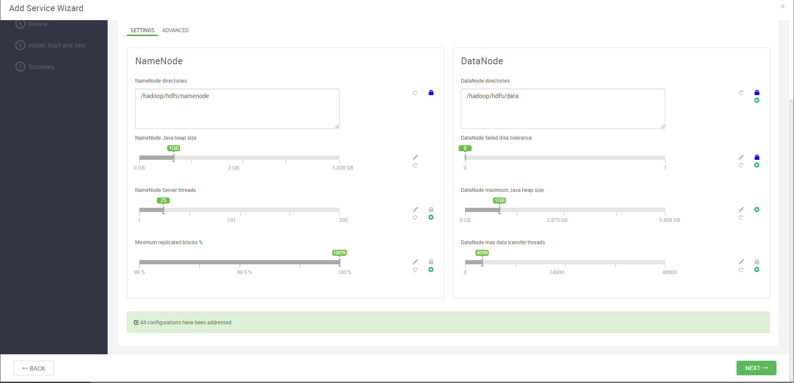
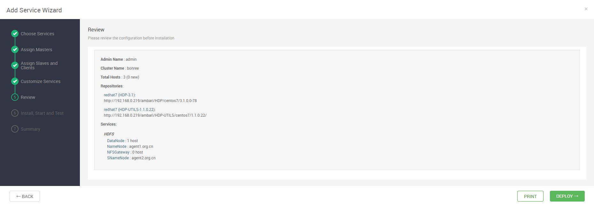
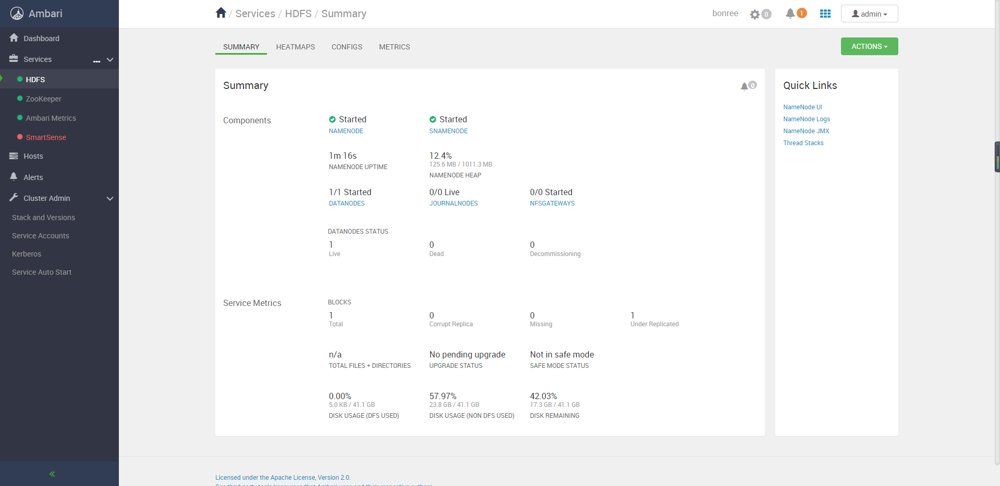
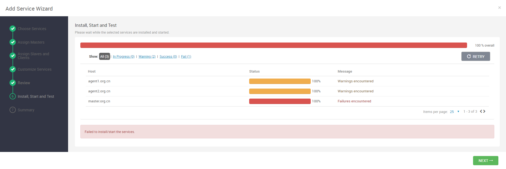

# Ambari部署HDFS组件

## HDFS组件部署过程

### 添加服务

点击add service，选择HDFS组件，进行安装：



### 组件分配

对组件进行分配，以使资源保持均衡：



### 节点和客户端分配

对节点进行分配安装：


### 配置修改

修改配置，但是一般直接默认：



### 查看安装情况

查看安装情况：



### 开始安装

开始安装组件：


### 安装成功

HDFS组件安装成功：


### 效果页面

安装后效果如下：



## 问题

## 问题一

在安装过程中出现问题如下：

```bash
Traceback (most recent call last):
  File "/var/lib/ambari-agent/cache/stacks/HDP/3.0/services/HDFS/package/scripts/datanode.py", line 126, in <module>
    DataNode().execute()
  File "/usr/lib/ambari-agent/lib/resource_management/libraries/script/script.py", line 352, in execute
    method(env)
  File "/var/lib/ambari-agent/cache/stacks/HDP/3.0/services/HDFS/package/scripts/datanode.py", line 45, in install
    self.install_packages(env)
  File "/usr/lib/ambari-agent/lib/resource_management/libraries/script/script.py", line 849, in install_packages
    retry_count=agent_stack_retry_count)
  File "/usr/lib/ambari-agent/lib/resource_management/core/base.py", line 166, in __init__
    self.env.run()
  File "/usr/lib/ambari-agent/lib/resource_management/core/environment.py", line 160, in run
    self.run_action(resource, action)
  File "/usr/lib/ambari-agent/lib/resource_management/core/environment.py", line 124, in run_action
    provider_action()
  File "/usr/lib/ambari-agent/lib/resource_management/core/providers/packaging.py", line 30, in action_install
    self._pkg_manager.install_package(package_name, self.__create_context())
  File "/usr/lib/ambari-agent/lib/ambari_commons/repo_manager/yum_manager.py", line 219, in install_package
    shell.repository_manager_executor(cmd, self.properties, context)
  File "/usr/lib/ambari-agent/lib/ambari_commons/shell.py", line 753, in repository_manager_executor
    raise RuntimeError(message)
RuntimeError: Failed to execute command '/usr/bin/yum -y install hadoop_3_1_0_0_78-client', exited with code '1', message: 'Error: Package: hadoop_3_1_0_0_78-hdfs-3.1.1.3.1.0.0-78.x86_64 (HDP-3.1-repo-1)

           Requires: libtirpc-devel
'
```

出现问题的原因是缺少依赖：

```bash
-rw-r--r--  1 root root     90472 Nov  4 15:25 libtirpc-0.2.4-0.16.el7.i686.rpm
-rw-r--r--  1 root root     93252 Nov  4 15:25 libtirpc-devel-0.2.4-0.16.el7.i686.rpm
```

只需要从[资源地址](http://rpmfind.net/)下载资源包后，执行命令进行安装即可：

```bash
$ rpm -ivh --nodeps libtirpc-0.2.4-0.16.el7.i686.rpm
$ rpm -ivh --nodeps libtirpc-devel-0.2.4-0.16.el7.i686.rpm  # 其中--nodeps的意思是不安装依赖
```

安装之后，点击如图所示的RETRY按钮重新部署即可：


