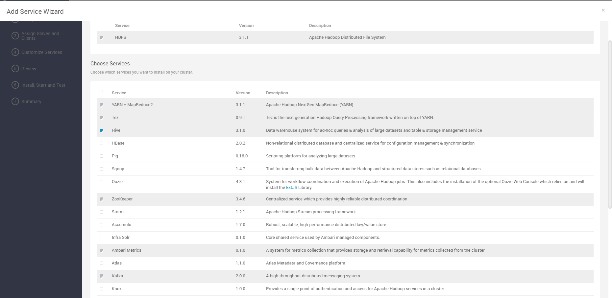
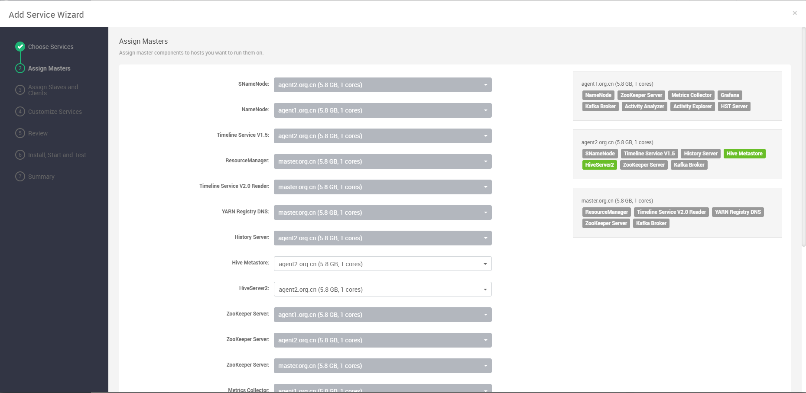
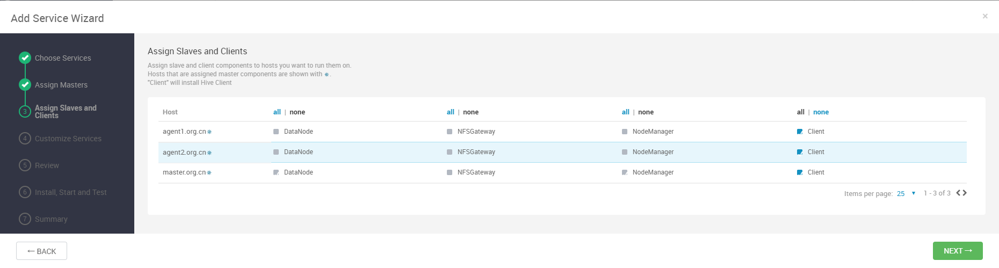
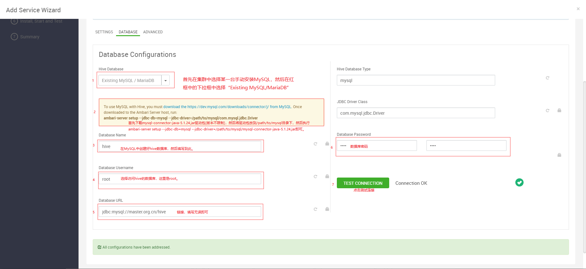
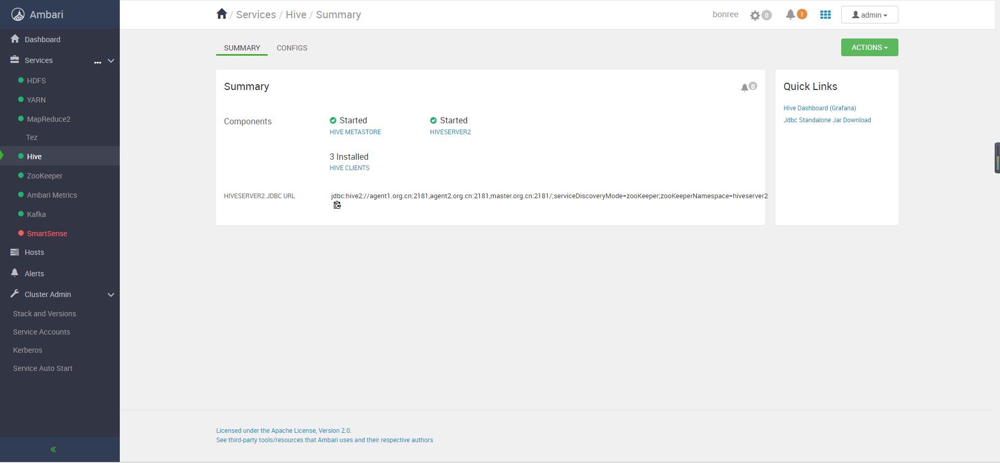

# Ambari部署Hive组件

## Hive组件部署过程

### 添加服务

点击add service，选择Hive组件，进行安装：



备注：安装Hive之前需要先安装Tez，Tez安装简单，不再赘述！

### 组件分配

对组件进行分配，以使资源保持均衡：



### 节点和客户端分配



### 配置修改



图中第二个步骤执行如下：

```bash
[root@master mysql]# ll
total 828
-rw-r--r-- 1 root root 846263 Nov  6 11:29 mysql-connector-java-5.1.24.jar
[root@master mysql]# ambari-server setup --jdbc-db=mysql --jdbc-driver=/path/to/mysql/mysql-connector-java-5.1.24.jar
Using python  /usr/bin/python
Setup ambari-server
Copying /path/to/mysql/mysql-connector-java-5.1.24.jar to /var/lib/ambari-server/resources/mysql-connector-java-5.1.24.jar
Creating symlink /var/lib/ambari-server/resources/mysql-connector-java-5.1.24.jar to /var/lib/ambari-server/resources/mysql-connector-java.jar
If you are updating existing jdbc driver jar for mysql with mysql-connector-java-5.1.24.jar. Please remove the old driver jar, from all hosts. Restarting services that need the driver, will automatically copy the new jar to the hosts.
JDBC driver was successfully initialized.
Ambari Server 'setup' completed successfully.
```

### 查看安装情况

略。

### 开始安装

略。

### 安装成功


