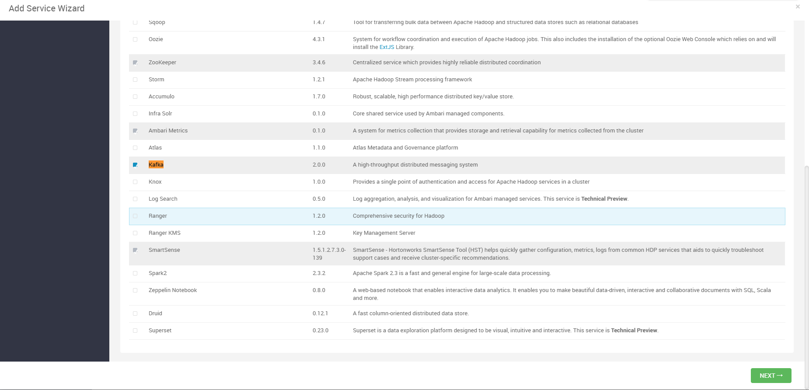
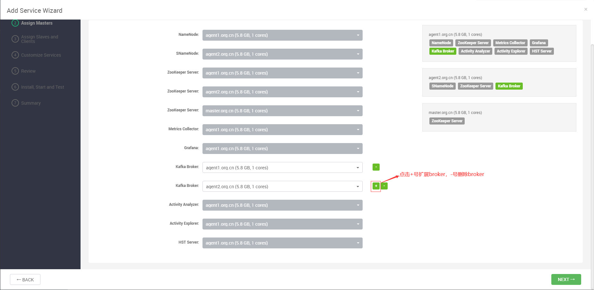
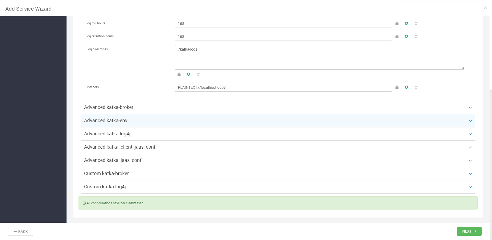
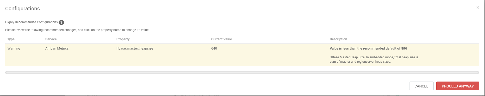
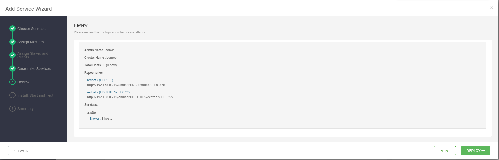
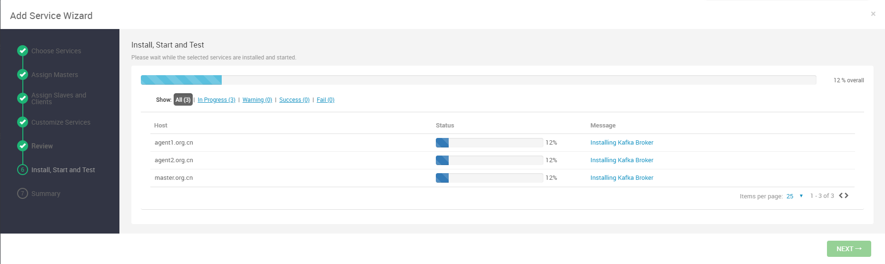
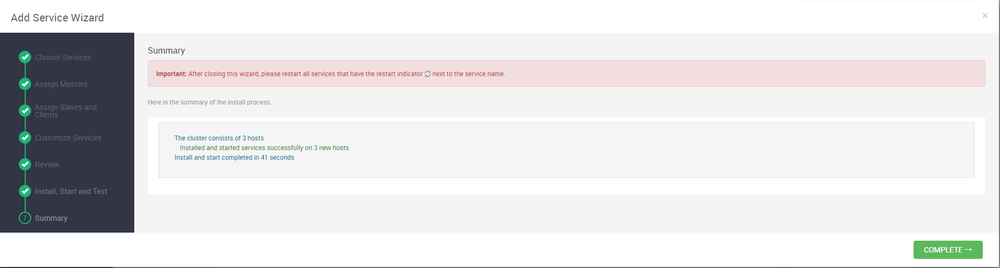
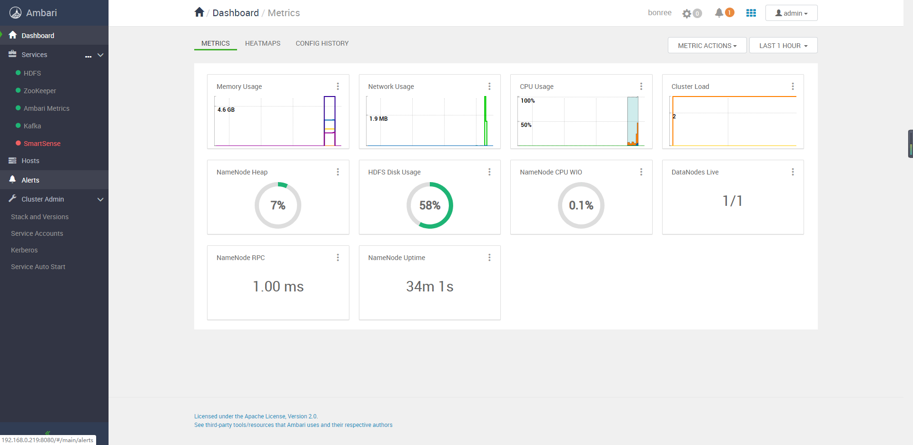

# Ambari部署Kafka组件

## Kafka组件部署过程

### 添加服务

点击add service，选择Kafka组件，进行安装：

### 组件分配

对组件进行分配，以使资源保持均衡：

### 配置修改

修改配置，但是一般直接默认：

### 配置参数值修改

安装过程中，可能由于一些配置参数值没有达到默认值，如下所示：

此时只需要查看对应组件下的对应参数，然后按照提示的值进行修改即可！

### 查看安装情况

查看安装情况：

### 开始安装

开始安装组件：

### 安装成功

Kafka组件安装成功：

### 效果页面

安装后效果如下：

