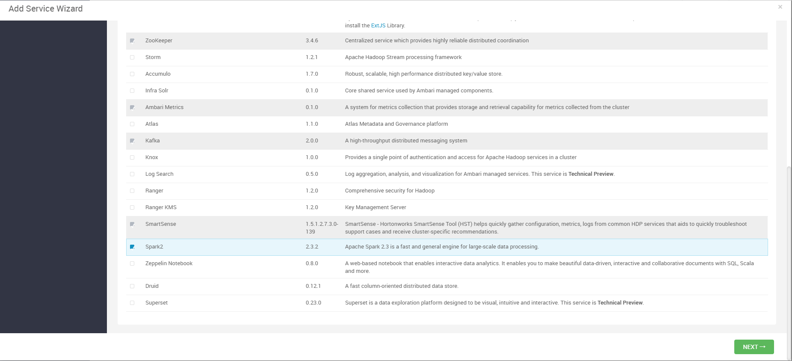
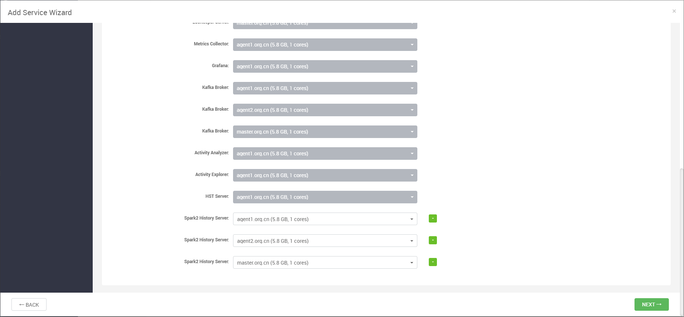
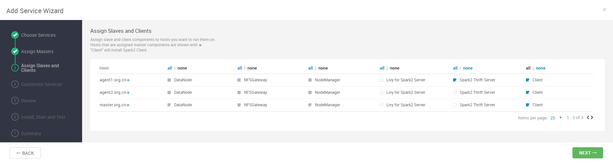
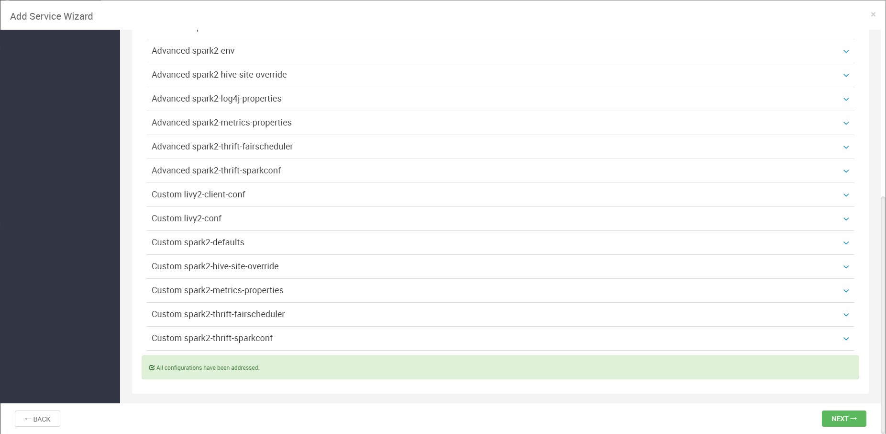
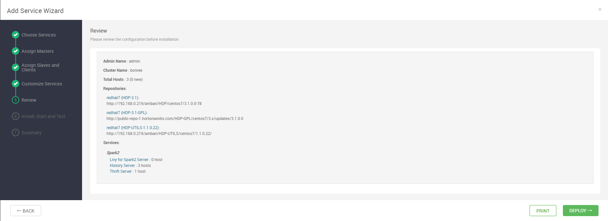
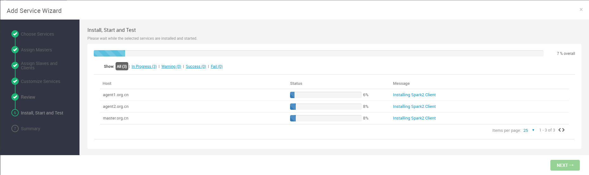
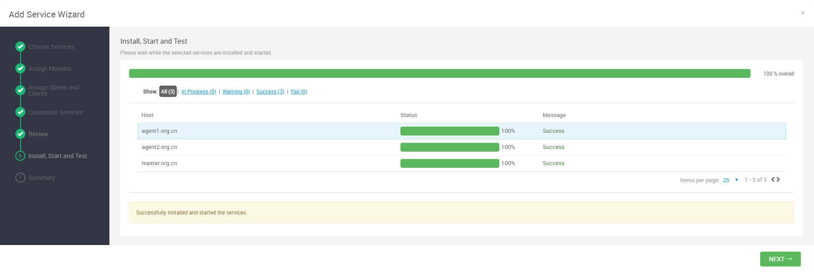
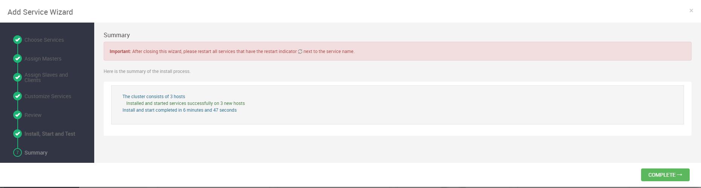

# Ambari部署Spark2组件

## Spark2组件部署过程

### 添加服务

点击add service，选择Spark2组件，进行安装：

备注：安装Spark2之前需要先安装Tez服务和Hive服务，Tez安装简单，不再赘述，Hive服务的安装详情见文档[Ambari部署Hive组件](Ambari部署Hive组件.md)。

### 组件分配

对组件进行分配，以使资源保持均衡：

### 节点和客户端分配

### 配置修改

下面对配置进行修改，但是一般不进行改动，直接默认即可：

### 查看安装信息

### 开始安装

### 安装成功

### 效果展示

此时点击COMPLETE，然后将需要重新启动的组件重新启动即可！
