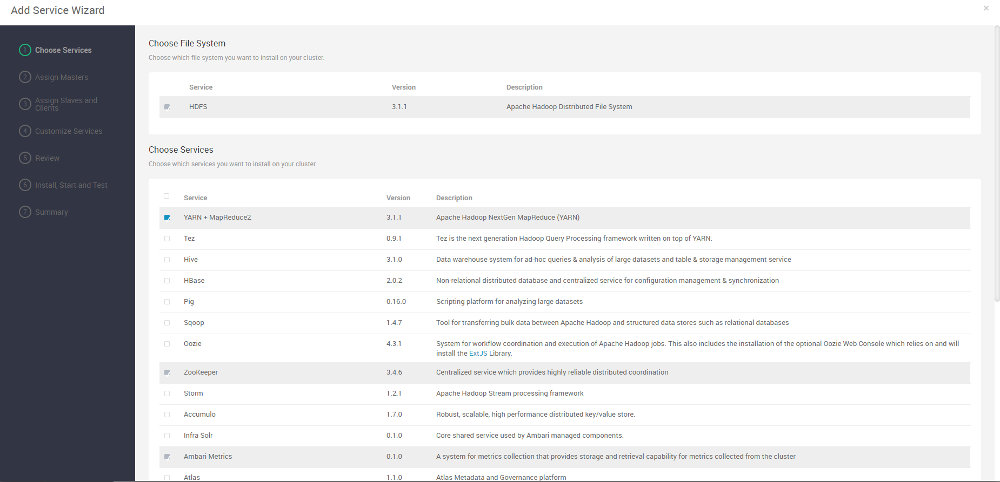
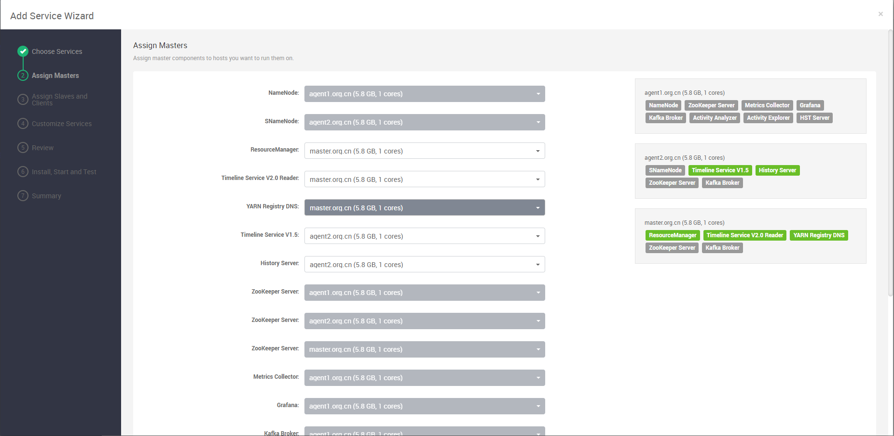
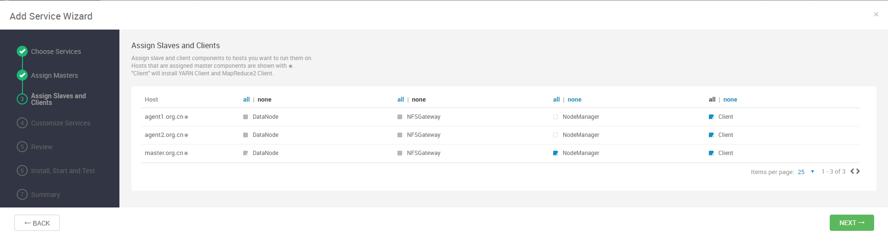
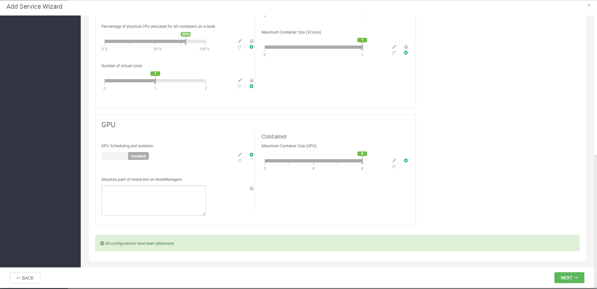
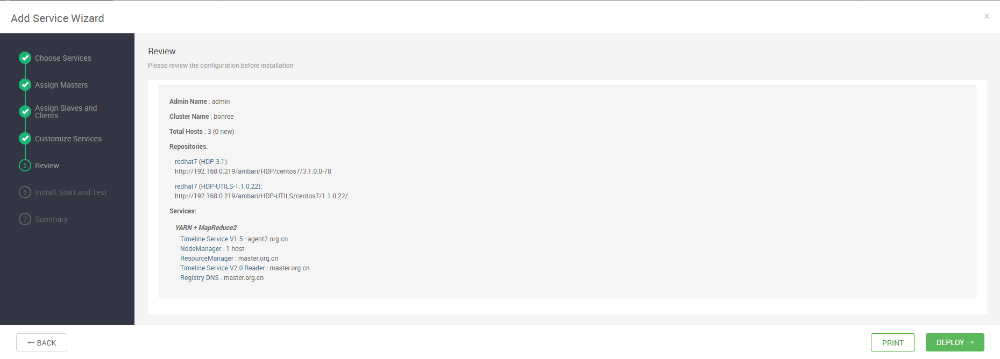
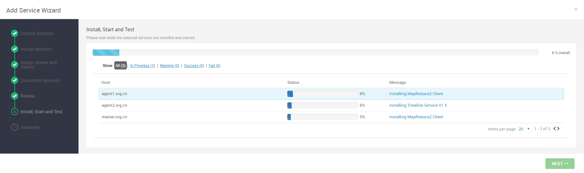
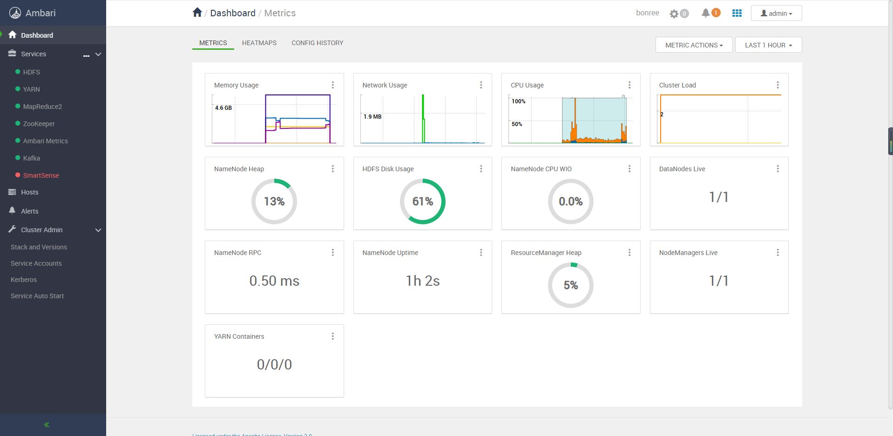

# Ambari部署Yarn+MapReduce组件

## Yarn+MapReduce组件部署过程

### 添加服务

点击add service，选择Yarn+MapReduce组件，进行安装：

### 组件分配

对组件进行分配，以使资源保持均衡：

### 节点和客户端分配

对节点进行分配安装：

### 配置修改

修改配置，但是一般直接默认：

### 查看安装情况

查看安装情况：

### 开始安装

开始安装组件：

### 安装成功

Yarn+MapReduce组件安装成功：

